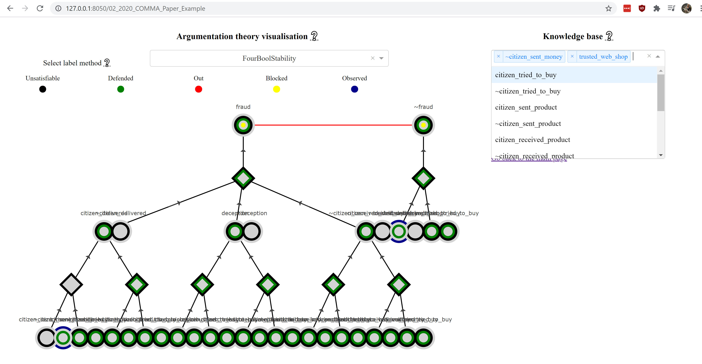

Visualisation of Labelling Algorithms
=====================================
In order to see how the labelling algorithms work, you can run the visualisation, by running
stability_label_algorithm / visualisation_interface / app.py.

Then browse to `http://127.0.0.1:8050/ <http://127.0.0.1:8050/>`_.

You should see something like:

.. image:: screenshot_choose_argumentation_theory.PNG

Choose an argumentation theory from this menu.
Then the chosen argumentation theory is visualised, like in the image below.
You can select a labeler, change the argumentation theory by adding elements to the knowledge base and
changing the view of the figure by selecting a different topic.

